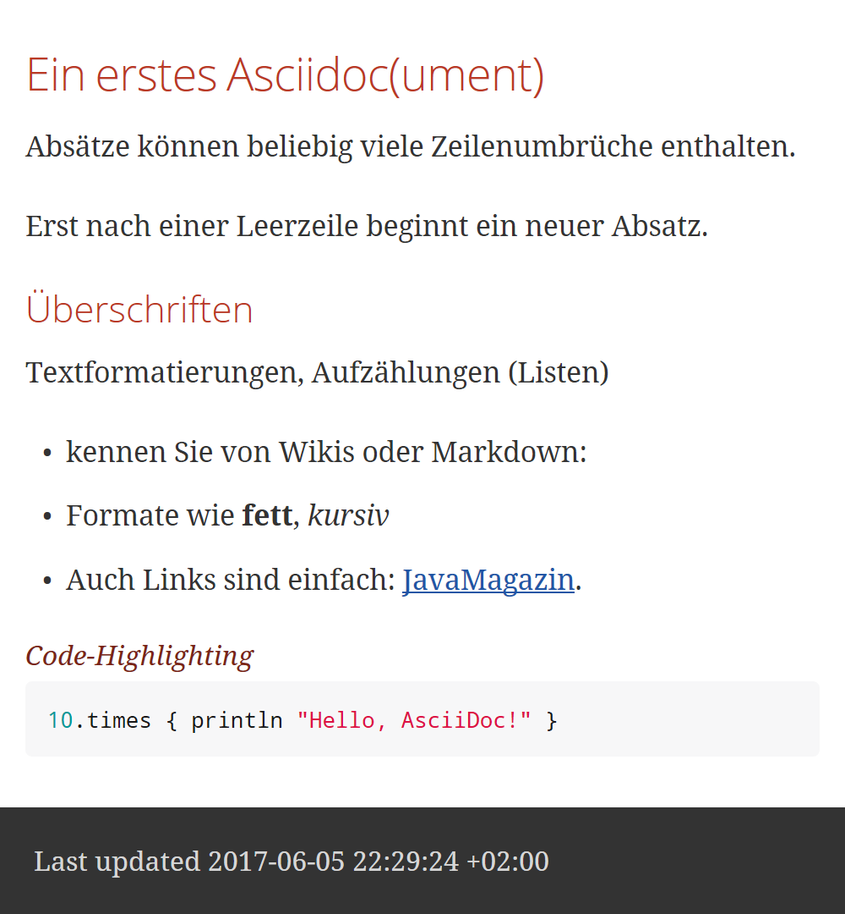

= image:../hhgdac-logo.png[] Folge 1: Docs-as-Code

[small]
--
Source und Infos zur JavaMagazin-Kolumne von https://rdmueller.github.io/[R.D. Müller] und http://gernotstarke.de[G. Starke]

https://jaxenter.de/docs-as-code-asciidoctor-62432[Folge 1: Hitchhiker’s Guide to Docs as Code]
--

Wir möchten Dokumentation in der Softwareentwicklung von vielerlei typischen Schmerzen befreien:

* Wir _generieren_ Dokumente, beispielsweise Architektur-, Schnittstellen- oder Betriebsdokumentation.

* Wir arbeiten dabei DRY, modular und flexibel.

* Wir erzeugen _zielgruppenspezifische_ Ergebnisse, u.a. in HTML, pdf, docx oder Confluence.

== Voraussetzungen

* https://gradle.org/install[Gradle] installiert zu haben, hilft ungemein... Wir bevorzugen die Installation über http://sdkman.io/[sdkman], den großartigen Package-Manager.
* Eine Shell/Kommandozeile/Terminal.

== Einführung
Wir haben einen Wrapper für Gradle zugefügt - das macht den Einstieg für Sie noch einfacher:

    cd folge-1
    ./gradlew asciidoctor

Falls Sie Gradle bereits installiert haben, geht's auch so:

    cd folge-1
    gradle asciidoctor

Das Ergebnis, die Datei `hello.html`, wird ins Verzeichnis
`./build/asciidoc/html5` generiert, und sollte
etwa wie folgt aussehen:

