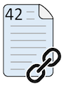

// part of the AsciiDoc Architecture Documentation 101
// by R.D. Mueller and Gernot Starke

== Images

=== Simple images

----

----

=== Images with caption

----
.Diagram-Title

----

.Diagram-Title

=== Images with caption and alt-text

----

----

=== Referencing diagrams

You can even reference images, see figure <>:

----
...see figure <>
----

----
[[img-ref-example]]

----

[[img-ref-example]]

=== Referencing Diagrams by Number

WARNING: I currently have no clue how to reference figure-numbers
(their counter)...

=== (Re-)Sizing Images

A simple way to specify the size of an image is
to define the width and height attributes.
Since these two attributes are so common,
they are the second and third (unnamed) positional
attributes.

----
image::flower.jpg[Flower,640,480]
----

That’s equivalent to the long-hand version:

----
image::flower.jpg[alt=Flower,width=640,height=480]
----

image::flower.jpg[Flower,640,480]
