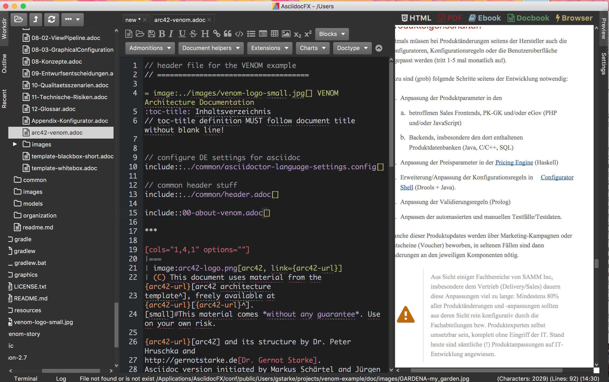
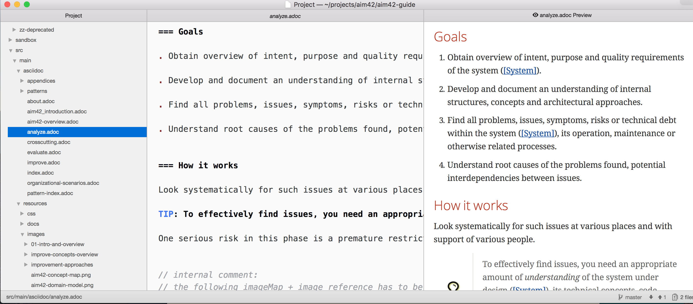
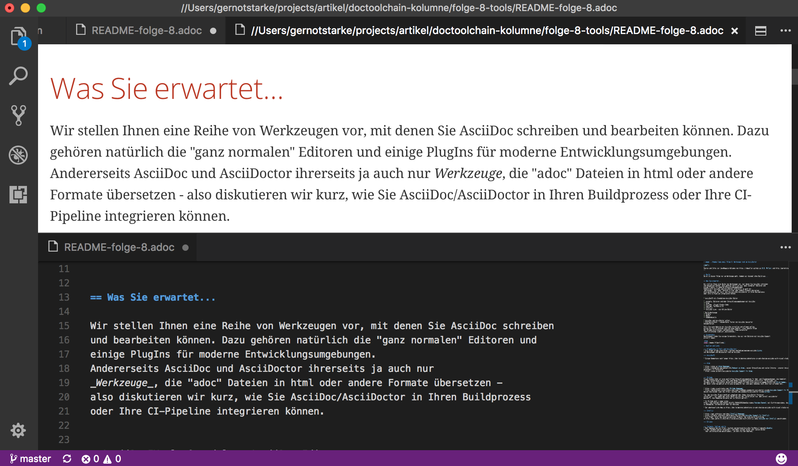
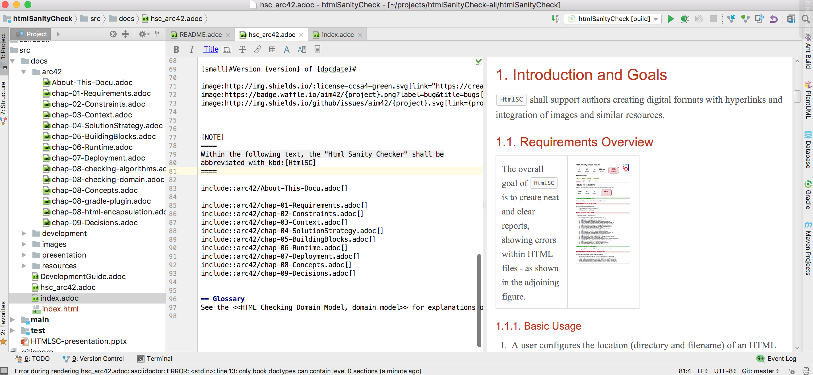
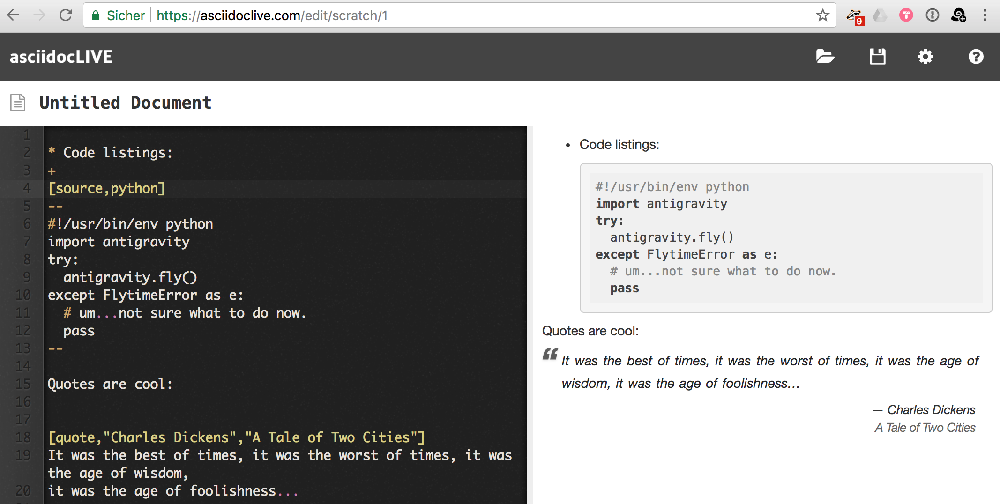
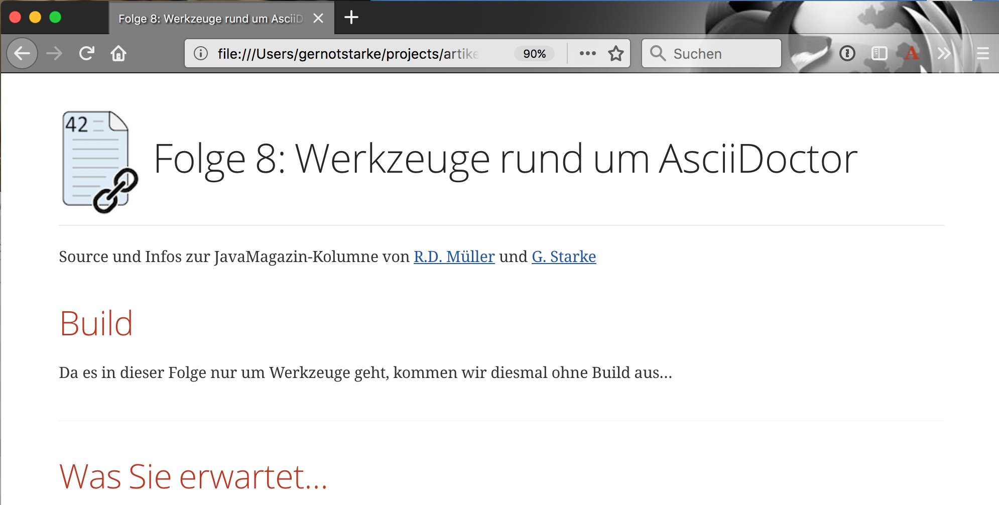

= image:../hhgdac-logo.png[] Folge 8: Werkzeuge rund um AsciiDoctor

[small]
--
Sources und Infos zur JavaMagazin-Kolumne von https://rdmueller.github.io/[R.D. Müller] und http://gernotstarke.de[G. Starke]

https://jaxenter.de/hitchhikers-guide-to-docs-as-code-tools-fuer-asciidoc-asciidoctor-70828[Folge 8: Tools für AsciiDoc/Asciidoctor]

--

== Build
Da es in dieser Folge nur um Werkzeuge geht, kommen wir diesmal ohne Build aus...

== Was Sie erwartet...

Wir stellen Ihnen eine Reihe von Werkzeugen vor, mit denen Sie AsciiDoc schreiben
und bearbeiten können. Dazu gehören natürlich die "ganz normalen" Editoren und
einige PlugIns für moderne Entwicklungsumgebungen.
Andererseits sind AsciiDoc und AsciiDoctor ihrerseits ja auch nur
_Werkzeuge_, die "adoc" Dateien in html oder andere Formate übersetzen -
also diskutieren wir kurz, wie Sie AsciiDoc/AsciiDoctor in Ihren Buildprozess oder Ihre CI-Pipeline integrieren können.

Der Zweck DIESER Datei ist diesmal mehr eine **Link-Sammlung**,
und weniger eine Anleitung für eigene docs-as-code Experimente.

* <<AsciiDocFX>> als Standalone-AsciiDoc Editor
* _normale_ Editoren und/oder Entwicklungsumgebungen mit AsciiDoc
** <<Atom>>
** <<VS-Code>>, (Visual-Studio Code)
** <<textmate-sublime, Sublime, TextMate & Co>>
** <<IntelliJ>>
** <<Eclipse>>
** <<AsciiDoc Live>> - ein Online-Editor
** <<Browser-Live-Preview>>

* Build-Werkzeuge
** Gradle
** Maven
** Kommandozeile

* <<asciidocports, AsciiDoc, AsciiDoctor und Portierungen>> selbst
* HtmlSanityCheck - rudimentäres Testen von AsciiDoc basierter
Dokumentation.

Falls Sie eine Website mit AsciiDoc erstellen und pflegen wollen,
bitten wir Sie allerdings noch um etwas Geduld - eine spätere Folge
der Kolumne wird dieses (umfangreiche) Thema aufgreifen
(dann allerdings ziemlich _opinionated_)...

== Quellen und Links

=== Allgemeines zu Tools und AsciiDoc(tor)
* Eric Pragt pflegt eine https://github.com/bodiam/awesome-asciidoc[Liste]
von Werkzeugen und Beispielen rund um AsciiDoc.

=== AsciiDocFX

.AsciiDocFX Screenshot

* Die https://asciidocfx.com/[AsciiDocFX Homepage]
* Einige Kommentare nach langer https://dev.to/mgroves/adventures-in-yak-shaving-asciidoc-with-visual-studio-code-ruby-and-gem[Nutzung von AsciiDocFX]

=== Atom

.Atom Screenshot

* https://atom.io/[Atom Homepage]
* https://changelog.com/podcast/241[Podcast zu Atom] mit den ursprünglichen Autor,
Details zur Entwicklung und viele Interna - unserer Ansicht nach
hörenswert für Entwickler
* https://atom.io/users/asciidoctor[AsciiDoc Support für Atom]

=== VS-Code
Visual-Studio Code ist eine quelloffene Entwicklungsumgebung für Web- und Cloudanwendungen, die komplett
auf Web-Technologien basiert und jede Menge Programmiersprachen unterstützt. Miterfinder ist
übrigens https://entwickler.de/online/development/vs-code-interview-erich-gamma-253242.html[Erich Gamma],
der davor schon maßgeblich an Eclipse mitgewirkt hat (und ganz nebenbei noch JUnit mit erfunden hat).

.VS-Code Screenshot

* https://code.visualstudio.com/[VS-Code Homepage]
* https://marketplace.visualstudio.com/items?itemName=joaompinto.asciidoctor-vscode[Asciidoc-Support für VS-Code],
dessen Sourcecode liegt bei https://github.com/joaompinto/asciidoctor-vscode[Github].

TIP: Das AsciiDoc Plugin benötigt unbedingt den (Ruby-)AsciiDoctor Prozessor
installiert - wir haben das unter MacOS nur mit der Installation via 'gem install asciidoctor'
geschafft, die Homebrew-Variante hat zu Fehlern geführt...

* https://code.visualstudio.com/docs/editor/codebasics[Multi-Cursor-Support] für VS-Code, ein selten benutztes,
aber in diesen seltenen Fällen immens hilfreiches Feature...
* Zu VS-Code gibt's sogar einen
https://www.youtube.com/channel/UCs5Y5_7XK8HLDX0SLNwkd3w/videos[Youtube-Channel] mit Einführungsvideos, beispielsweise
zu Debugging, Customization oder Git-Nutzung.

* Der abenteuerliche Weg zu https://dev.to/mgroves/adventures-in-yak-shaving-asciidoc-with-visual-studio-code-ruby-and-gem[VS-Code mit AsciiDoc] unter Windows

=== IntelliJ

.IntelliJ-AsciiDoc Screenshot mit Nested-Includes

* https://www.jetbrains.com/idea/[IntelliJ Homepage]
* https://plugins.jetbrains.com/plugin/7391-asciidoc[AsciiDoc Support für IntelliJ]
* Eric Pragt, Autor des IntelliJ-AsciiDoc Plugins, hat eine kurze Einführung
zu http://www.jworks.nl/2015/08/17/using-asciidoc-with-intellij-idea/[AsciiDoc mit IntelliJ] geschrieben.

=== Eclipse
Mit Eclipse und AsciiDoc habe ich (Gernot) keine praktische
Erfahrung.

[[textmate-sublime]]
=== Textmate, Sublime und Co
* Matt Neuburg hat ein https://github.com/mattneub/AsciiDoc-TextMate-2.tmbundle[Bundle]
für den TextMate Editor entwickelt (und damit einige seiner sehr coolen Bücher
  über ioS-Entwicklung geschrieben), _he eats his own dogfood_.

=== AsciiDoc Live
Ein browserbasierter (Online)-Editor für AsciiDoc.

=== Browser-Live-Preview

* Auf der AsciiDoctor Homepage gibt's eine kurze Einführung
in http://asciidoctor.org/docs/editing-asciidoc-with-live-preview/[LivePreview]
für unterschiedliche Browser
* Die Plugins für Firefox, Chrome und Opera wurden bei
https://github.com/asciidoctor/asciidoctor-firefox-addon[Github]
entwickelt - allerdings nicht mehr aktiv weitergepflegt.
* Für Firefox gibt's auf der
https://addons.mozilla.org/de/firefox/addon/asciidoctorjs-live-preview/[Add-ons Seite eine unterstützte Version].

[[asciidocports]]
=== AsciiDoc, AsciiDoctor und Portierungen

1. AsciiDoc war die ursprüngliche https://github.com/asciidoc/asciidoc[Referenzimplementierung (in Python)]
von http://www.methods.co.nz/stuart.html[Stuart Rackham], die es seit ca. 2002 gibt.
Die http://asciidoc.org/[AsciiDoc Homepage], gleichzeitig Heimat der ursprünglichen Syntaxdefinition.
2. AsciiDoctor ist eine vollständige Neuimplementierung in Ruby,
die (im Gegensatz zur früheren Python-Version) signifikant auf Performance, Modularisierung
udn Erweiterbarkeit Wert legt. Sie wird maßgeblich von
https://www.linkedin.com/in/mojavelinux/de[Dan Allen]
(Twitter: https://twitter.com/mojavelinux?lang=de[@mojavelinux])] gepflegt.
http://asciidoctor.org/[AsciiDoctor Homepage].
3. https://github.com/asciidoctor/asciidoctor.js[AsciiDoc.js] ist eine JavaScript-Version von AsciiDoctor, die über Opal
Source-2-Source Compiler von Ruby in JavaScript übersetzt wird. Grundlage
für die in-Browser-live-Preview AddOns.
